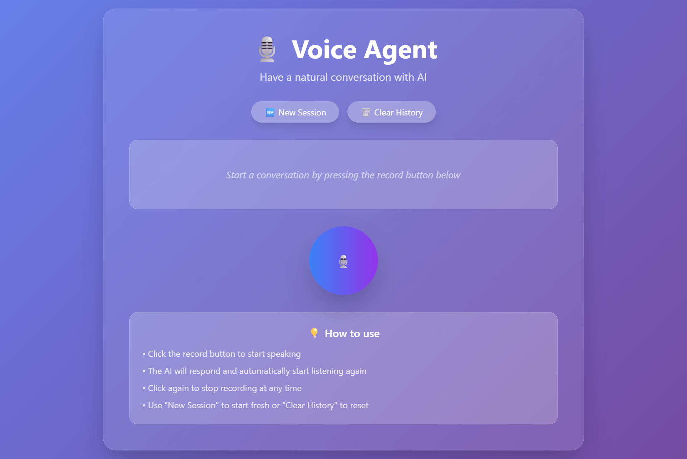

# 🎙️ Voice Agent - Conversational AI

A sophisticated web-based voice agent that enables natural conversations with AI through speech. The application features real-time speech-to-text transcription, intelligent responses powered by Google's Gemini AI, and high-quality text-to-speech synthesis using Murf AI.

## 📸 Screenshots

### Main Interface


*The glassmorphism-styled main interface with the record button*

### Recording State


*Active recording with pulse animations and audio visualizer*

### Chat History


*Conversation history with user and AI messages*

## ✨ Features

- **🎤 Real-time Voice Recording**: Click-to-talk interface with visual audio feedback
- **🔄 Continuous Conversations**: Automatic recording restart after AI responses
- **📝 Speech-to-Text**: Powered by AssemblyAI for accurate transcription
- **🧠 AI Intelligence**: Google Gemini 1.5 Flash for contextual responses
- **🔊 Natural Speech Synthesis**: High-quality voice output via Murf AI
- **💬 Session Management**: Persistent chat history with session support
- **🎨 Modern UI**: Glassmorphism design with smooth animations
- **📊 Audio Visualizer**: Real-time frequency visualization during recording
- **🛡️ Robust Error Handling**: Comprehensive fallback mechanisms
- **📱 Responsive Design**: Works on desktop and mobile devices

## 🏗️ Architecture

The application follows a modern client-server architecture:

### Frontend

- **HTML5** with semantic structure
- **Tailwind CSS** for styling and responsive design
- **Vanilla JavaScript** for dynamic interactions
- **Web Audio API** for recording and visualization
- **MediaRecorder API** for audio capture

### Backend

- **FastAPI** (Python) - High-performance web framework
- **AssemblyAI** - Speech-to-text transcription
- **Google Gemini AI** - Language model for responses
- **Murf AI** - Text-to-speech synthesis
- **httpx** - Async HTTP client for API calls

### Data Flow

1. User speaks → Web Audio API captures audio
2. Audio sent to FastAPI backend
3. AssemblyAI transcribes speech to text
4. Gemini AI generates contextual response
5. Murf AI converts response to speech
6. Audio returned to frontend and played
7. Conversation continues automatically

## 🚀 Technologies Used

### Frontend Technologies

- **HTML5**: Semantic markup and structure
- **CSS3**: Modern styling with glassmorphism effects
- **JavaScript ES6+**: Modern JavaScript features
- **Tailwind CSS**: Utility-first CSS framework
- **Web APIs**:
  - MediaRecorder API
  - Web Audio API
  - Canvas API (for visualizations)
  - Fetch API

### Backend Technologies

- **Python 3.8+**: Core programming language
- **FastAPI**: Modern, fast web framework
- **Uvicorn**: ASGI server
- **httpx**: HTTP client library
- **python-dotenv**: Environment variable management

### External APIs & Services

- **AssemblyAI**: Speech-to-text transcription
- **Google Gemini AI**: Large language model
- **Murf AI**: Text-to-speech synthesis

## 📦 Installation

### Prerequisites

- Python 3.8 or higher
- Modern web browser with microphone support
- API keys for AssemblyAI, Google Gemini, and Murf AI

### 1. Clone the Repository

```bash
git clone <repository-url>
cd voice-agent
```

### 2. Create Virtual Environment

```bash
python -m venv venv
source venv/bin/activate  # On Windows: venv\Scripts\activate
```

### 3. Install Dependencies

```bash
pip install -r requirements.txt
```

### 4. Set Up Environment Variables

Create a `.env` file in the root directory:

```env
# Required API Keys
ASSEMBLYAI_API_KEY=your_assemblyai_api_key_here
GEMINI_API_KEY=your_google_gemini_api_key_here
MURF_API_KEY=your_murf_api_key_here

# Optional Configuration
LOG_LEVEL=INFO
```

## 🔑 API Key Setup

### AssemblyAI API Key

1. Visit [AssemblyAI](https://www.assemblyai.com/)
2. Sign up for an account
3. Navigate to your dashboard
4. Copy your API key

### Google Gemini API Key

1. Go to [Google AI Studio](https://makersuite.google.com/)
2. Create a new project or select existing
3. Generate an API key
4. Copy the key

### Murf AI API Key

1. Visit [Murf AI](https://murf.ai/)
2. Sign up for an account
3. Access your API settings
4. Generate and copy your API key

## 🚀 Running the Application

### 1. Start the FastAPI Server

```bash
uvicorn main:app --reload --host 0.0.0.0 --port 8000
```

### 2. Access the Application

Open your web browser and navigate to:

```
http://localhost:8000
```

### 3. Grant Microphone Permissions

When prompted, allow microphone access for the voice features to work.

## 📁 Project Structure

```
voice-agent/
├── main.py                 # FastAPI backend server
├── templates/
│   └── index.html          # Main HTML template
├── static/
│   └── script.js           # Frontend JavaScript
├── uploads/                # Temporary audio file storage
├── requirements.txt        # Python dependencies
├── .env                    # Environment variables (create this)
├── .gitignore             # Git ignore file
└── README.md              # This file
```

## 🎯 Usage

### Starting a Conversation

1. Click the large microphone button to start recording
2. Speak your message clearly
3. Click the button again to stop recording
4. Wait for the AI to process and respond
5. The conversation continues automatically

### Session Management

- **New Session**: Start a fresh conversation
- **Clear History**: Remove all messages from current session
- Sessions persist until manually cleared or new session created

### Audio Visualizer

The application displays real-time audio frequency data while recording, providing visual feedback of your voice input.

## 🛡️ Error Handling

The application includes comprehensive error handling:

- **API Failures**: Graceful fallbacks when external APIs are unavailable
- **Network Issues**: Retry mechanisms and user-friendly error messages
- **Audio Permissions**: Clear instructions when microphone access is denied
- **Invalid Responses**: Fallback messages for processing errors

## 🔧 Configuration

### Environment Variables

| Variable | Description | Required |
|----------|-------------|----------|
| `ASSEMBLYAI_API_KEY` | AssemblyAI API key for speech-to-text | Yes |
| `GEMINI_API_KEY` | Google Gemini API key for AI responses | Yes |
| `MURF_API_KEY` | Murf AI API key for text-to-speech | Yes |
| `LOG_LEVEL` | Logging level (INFO, DEBUG, ERROR) | No |

### API Configuration

The application uses the following API endpoints:

- **AssemblyAI**: Speech transcription
- **Google Gemini**: `gemini-1.5-flash` model
- **Murf AI**: `en-US-terrell` voice, MP3 format, 24kHz stereo

## 🐛 Troubleshooting

### Common Issues

1. **Microphone Not Working**
   - Ensure browser permissions are granted
   - Check if microphone is being used by other applications
   - Try refreshing the page

2. **API Errors**
   - Verify all API keys are correctly set in `.env`
   - Check API key validity and quotas
   - Review server logs for specific error messages

3. **Audio Playback Issues**
   - Check browser audio settings
   - Ensure speakers/headphones are connected
   - Try a different browser

### Debug Mode

To enable detailed logging:

```bash
uvicorn main:app --reload --log-level debug
```

## 📱 Browser Compatibility

- **Chrome**: Full support (recommended)
- **Firefox**: Full support
- **Safari**: Partial support (may have audio limitations)
- **Edge**: Full support

## 🤝 Contributing

1. Fork the repository
2. Create a feature branch: `git checkout -b feature-name`
3. Commit your changes: `git commit -am 'Add feature'`
4. Push to the branch: `git push origin feature-name`
5. Submit a pull request

## 📄 License

This project is licensed under the MIT License - see the LICENSE file for details.

## 🙏 Acknowledgments

- [AssemblyAI](https://www.assemblyai.com/) for speech-to-text services
- [Google](https://ai.google.dev/) for Gemini AI language model
- [Murf AI](https://murf.ai/) for text-to-speech synthesis
- [FastAPI](https://fastapi.tiangolo.com/) for the excellent web framework
- [Tailwind CSS](https://tailwindcss.com/) for styling utilities

## 🔮 Future Enhancements

- [ ] Multi-language support
- [ ] Voice cloning capabilities
- [ ] Integration with more LLM providers
- [ ] Mobile app development
- [ ] Real-time streaming responses
- [ ] Custom voice training
- [ ] Advanced conversation analytics

----

Made with ❤️ by *Anik Kumar Adhikary*
